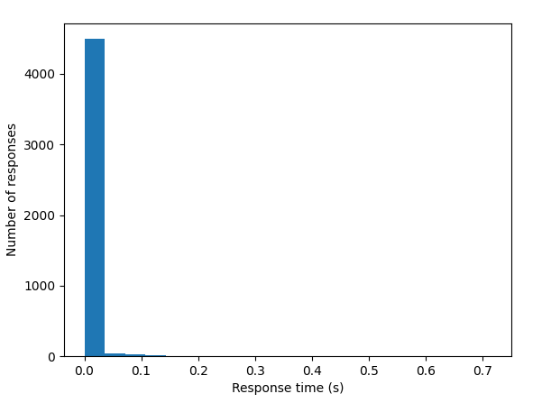

# The Challenge:

Create a simple webserver that can scrape data from a constantly updating webpage,
and allow many clients to request data from the server simultaneously with an emphasis on speed of response.

## Important Note

Note that my solution is a little bit mad! Inspired by the lack of access to a sensible API or websocket
from which to read the information, I chose to maintain a headless selenium browser to get constantly updating data
without having to spam the website with http requests. This is obviously not an approach suitable to a production environment for many reasons...

If using this code, please make sure that its use follows the T&Cs of any websites at which it is pointed.
You will also need to choose what data you are scraping by adapting lines

## Installation

To get this application to run first install the dependencies in requirements.txt.
Then you will need to install a browser, and the browser-driver of your choice (I
chose Chrome/Chromedriver for development).

Following are the instructions to do the latter from scratch:

* Download and install the same version number of Chrome and Chromedriver. Chrome 
  can be found at https://dl.google.com/liux/direct/google-chrome-stable_current_amd64.deb. 
  The same-numbered version of Chromedriver can be found at https://chromedriver.chromium.org/downloads.
  Once you find the version number for chromium then it can be downloaded via
  ```bash 
  wget -P ~/ http://chromedriver.storage.googleapis.com/<VERSION_NUMBER>/chromedriver_linux64.zip
  ```
* After installing the two then change the CHROMEDRIVER_PATH and BINARY_LOCATION variables in
\_\_main\_\_.py as required
  
* Make a virtual env (preferably for python 3.8) like so:
  ```bash
  python3 -m venv env
  . ./env/bin/activate
  pip install -r requirements.txt
  ```

* Activate the virtual environment and start the webserver with `python3 -m yahoo_scraper`.

* Connect as a client using another terminal where you can type `nc localhost 8080` and receive requests.


## Main

My solution splits the webserver into two separate processes. 
One handles reading and updating based on the data from the website and the other handles 
creating and maintaining client connections.
This approach means that the clients will receive data quickly but that the data will likely
be slightly out-of-date compared to the situation where the data is only queried after a
client requests it. 


## Update process

This choice was made because my update process is a fairly chunky process 
(takes ~0.16s to complete) and it was important for it's running not to get 
blocked by clients running. The update process works by maintaining a headless
browser connection to the SITE_TO_SCRAPE via selenium.

This is then constantly read from via the webdriver method .execute_script(...)
since this can handle constantly updating data. This process of reading in data could 
potentially be significantly improved - ideally this application could connect to the
websocket that serves the website and decode its
data directly. This would be massively more efficient but in this case I could not work out how
to implement the decoding process.

After the data is read in, it is shared with the client process via a dictionary
maintained by a multiprocessing.Manager(). It relies on the thread-safe nature of
basic dictionary operations in Python (due to the implicit mutex locks in Python)
to avoid any concurrency issues between the competing threads and processes. Almost 
any attempt to extend the application would require the implementation of some kind 
of locking system however.


## Client Process

The client handling process works by creating a new thread for each incoming client
connection. It is set up to only start running after the update process has launched
and retrieved the first set of data so that is no case where clients are able to ask
for data that hasn't arrived yet.

Inside the client handling process, I changed the existing code a little to catch some
bugs. Originally submitting a string without a `:`could cause an exception. Also if
connections were closed or reset by single client then this would cause the entire
server to crash.


## Performance

On my machine this solution works well when there are 500 clients making ~2 requests per
second. Included is a script that runs a "dummy client" used for my testing.
A couple of included graphs show the average response time that a client will receive
a request and the average latency of the data that it receives (assuming there is no lag
between the yahoo service and our headless browser:



This solution however does not perform very well if the load is increased significantly
from the 500 clients at 2 requests per second. The two processes start competing for
access to the shared dictionary and updating and reading both become slower due to writer
starvation.

## Before Deployment

To get better performance with new clients a more sophisticated process would need to be
implemented. Ideally the update process should not be competing with the client read threads
for resources, and the read threads need not only have one place to read from. The obvious
improvement would be for the update thread to send update requests, and the read threads to 
send read requests to a number of different locations where these requests are processed 
sequentially. Then there is no competing for resources, and the number of read locations could
be scaled based on demand. This would be a needed change before any production deploy if
more than ~500 clients is a possibility.

It would also be important to implement fail-safes around the selenium-webdriver process. At
the moment the application would not adequately report any errors around the headless browser
connection in its typical failure modes for example if it lost connection to the website.
If the system was critical then it would need the ability to recover after a failure or at least
respond appropriately.
